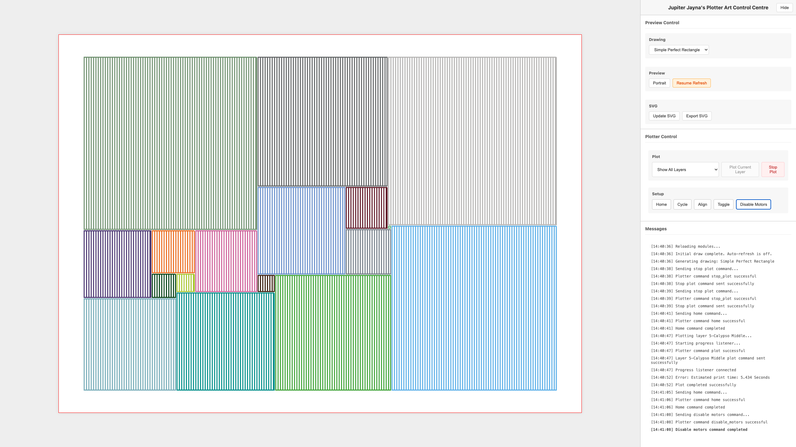

# Jupiter Jayna's Plotter Art Control Centre

A web-based tool for generating algorithmic art optimized for AxiDraw pen plotters. This project creates SVG files with separated layers for multi-pen plotting, featuring perfect square subdivisions (Bouwkamp codes), Delaunay triangulations, and Hilbert curves.



> **Note:** While this tool works with any AxiDraw plotter, it has been specifically developed and tested with the AxiDraw SE/A3 Special Edition model.

For examples of artwork created using similar techniques, visit [plotter.art](https://plotter.art), which showcases algorithmic plotter art with an emphasis on acrylic paint application and geometric patterns.

The project is optimized for two specific pen types:
- Molotow ONE4ALL™ Acrylic Markers (1mm and 2mm tips)
- Sakura Pigma Micron® Fineliners (0.2mm - 0.8mm)

## Contents

- [Features](#features)
  - [Drawing Algorithms](#drawing-algorithms)
  - [Real-time Development](#real-time-development)
  - [SVG Generation](#svg-generation)
  - [Multi-pen Support](#multi-pen-support)
- [Project Structure](#project-structure)
- [Getting Started](#getting-started)
  - [Prerequisites](#prerequisites)
  - [Installation](#installation)
- [Usage](#usage)
  - [Basic Operation](#basic-operation)
  - [File Output](#file-output)
  - [Creating Custom Drawings](#creating-custom-drawings)
- [Development](#development)
  - [Adding New Drawing Types](#adding-new-drawing-types)
  - [Error Handling and Recovery](#error-handling-and-recovery)
  - [Code Style](#code-style)
- [Color System](#color-system)
- [Plotter Configuration](#plotter-configuration)
- [Contributing](#contributing)
- [AI Development Assistance](#ai-development-assistance)
- [License](#license)
- [Support](#support)
- [Changelog](#changelog)
- [Acknowledgments](#acknowledgments)

## Features

- **Multiple Drawing Algorithms**
  - Bouwkamp codes (perfect square subdivisions)
  - Delaunay triangulations
  - Hilbert curves with configurable complexity
  - Portrait/Landscape orientation support
  - Content-aware SVG scaling
  - Millimeter-precise ruler visualization
  - Completion sound notifications with mute option
  - Debug message filtering with "All" and "Just Plots" tabs
  - Automatic temporary file cleanup
  - Error message highlighting in red
  - Bold highlighting for most recent debug message

- **Real-time Development**
  - Live preview with auto-refresh
  - Debug panel with real-time logging
    - Color-coded error messages
    - Automatic error recovery
  - Hot module reloading
  - Layer visibility controls

- **SVG Generation**
  - Automatic file saving with timestamps
  - Pretty-printed SVG output
  - Configuration preserved in comments
  - Dynamic viewBox calculation

- **Multi-pen Support**
  - Smart color separation into layers
  - Intelligent color selection system
  - Adjacent color avoidance
  - Inkscape-compatible layer naming

## Project Structure

```
├── client/
│   ├── js/
│   │   ├── app.js                # Main application logic
│   │   ├── colorPalette.js       # Color definitions and palettes
│   │   ├── configs/
│   │   │   └── BaseConfig.js     # Base configuration class
│   │   ├── drawings.js           # Drawing configurations
│   │   ├── drawings/
│   │   │   ├── bouwkamp.js      # Perfect square implementation
│   │   │   ├── delaunay.js      # Triangulation implementation
│   │   │   ├── hilbert.js       # Hilbert curve implementation
│   │   │   └── types.js         # Drawing type definitions
│   │   ├── paperConfig.js        # Paper size configurations
│   │   └── utils/
│   │       ├── colorUtils.js     # Color management utilities
│   │       ├── geometryUtils.js  # Geometric calculations
│   │       ├── patternUtils.js   # Pattern generation
│   │       ├── svgUtils.js       # SVG creation and manipulation
│   │       └── validationUtils.js # Input validation
│   ├── static/
│   │   ├── css/
│   │   │   └── styles.css       # Application styles
│   │   └── favicon.ico          # Site favicon
│   └── templates/
│       └── plotter.html         # Main application interface
├── server/
│   ├── __init__.py             # Server package initialization
│   ├── paper_config.py         # Paper configuration
│   ├── plotter_config.py       # Plotter settings
│   ├── server.py               # Main server implementation
│   └── server_runner.py        # Development server with hot reload
├── shared/
│   ├── medium_config.json      # Pen and medium configurations
│   └── paper_config.json       # Paper size definitions
├── docs/
│   └── server_commands.md      # Server API documentation
├── .eslintrc.json             # JavaScript linting rules
├── CHANGELOG.md               # Version history
├── CONTRIBUTING.md            # Contribution guidelines
├── LICENSE                    # MIT license
├── Makefile                  # Build and run commands
├── README.md                 # Project documentation
└── requirements.txt          # Python dependencies
```

## Getting Started

### Prerequisites

- macOS (currently only tested on Mac)
- Python 3.x
- Modern web browser (Chrome, Firefox, Safari)
- Git

### Installation

1. Clone the repository:
   ```bash
   git clone https://github.com/sdjayna/super-duper-octo-robot.git
   cd super-duper-octo-robot
   ```

2. Install dependencies:
   ```bash
   make install
   ```

3. Start the server:
   ```bash
   make run
   ```

4. Visit in your browser:
   ```
   http://localhost:8000
   ```

## Plotter Configuration

The project includes specific support for the AxiDraw SE/A3 plotter through `plotter_config.py` and paper configuration through `paper_config.json`.

### Paper Configuration
```json
{
    "papers": {
        "a3": {
            "width": 297,
            "height": 420,
            "margin": 59.4,
            "name": "A3",
            "description": "ISO A3 Paper"
        },
        "A4": {
            "width": 210,
            "height": 297,
            "margin": 42,
            "name": "A4",
            "description": "ISO A4 Paper"
        },
        "bristol": {
            "width": 432,
            "height": 279,
            "margin": 86.4,
            "name": "Bristol",
            "description": "Bristol Paper 432×279mm"
        }
    }
}
```

### Plotter Settings
```python
PLOTTER_CONFIGS = {
    'AxiDraw SE/A3': {
        'model': 2,   # Model number for AxiDraw SE/A3
        'pen_pos_up': 90,    # Pen up position (0-100)
        'pen_pos_down': 10,  # Pen down position (0-100)
        'penlift': 3    # Narrow-band brushless servo (3rd position up)
    }
}
```

### Configuration Parameters

- `model`: Specifies the plotter model (2 for AxiDraw SE/A3)
- `pen_pos_up`: Height of the pen when raised (0-100)
- `pen_pos_down`: Height of the pen when drawing (0-100)
- `pen_rate_lower`: Speed of pen lowering movement (1-100)
- `penlift`: Servo type configuration (3 for narrow-band brushless servo)

These settings are automatically applied to all plotter commands, ensuring consistent behavior across plotting sessions.

## Usage

### Basic Operation

1. Select a drawing type from the dropdown
2. Use the controls to:
   - Toggle orientation (Portrait/Landscape)
   - Show/hide the debug panel
   - Pause/resume auto-refresh
   - Save the current SVG
3. Use the layer selector to view specific pen colors

### File Output

SVG files are saved to the `output` directory:
```
output/
    simplePerfectRectangle/
        20250203-153022.svg
    delaunayExample/
        20250203-153024.svg
```

Each SVG includes:
- Configuration details in comments
- Inkscape-compatible layers
- Timestamp-based filename
- Pretty-printed SVG code

### Creating Custom Drawings

Add new drawings in `js/drawings.js`:

```javascript
export const drawings = {
    myNewDrawing: new DrawingConfig(
        'My Drawing Name',
        {
            type: 'bouwkamp',  // or 'delaunay'
            code: [...],       // for bouwkamp
            // or
            triangulation: {   // for delaunay
                points: [{x: 0, y: 0}, ...],
                width: 100,
                height: 100
            },
            paper: {
                width: 420,    // A3 width in mm
                height: 297,   // A3 height in mm
                margin: 12.5   // margin in mm
            },
            line: {
                spacing: 2.5,    // space between lines
                strokeWidth: 0.45,// SVG stroke width
                vertexGap: 0.5   // gap at vertices
            },
            colorPalette
        }
    )
};
```

## Development

### Adding New Drawing Types

1. Create a new file in `js/drawings/mynewtype.js`:
```javascript
import { createSVG, createColorGroups, createPath } from '../svgUtils.js';
import { ColorManager } from '../ColorManager.js';
import { BaseConfig } from '../configs/BaseConfig.js';

// Configuration class for this drawing type
export class MyNewConfig extends BaseConfig {
    constructor(params) {
        super(params);
        // Add type-specific parameters
        this.myParam = params.myParam || defaultValue;
        // BaseConfig provides:
        // this.width = params.paper?.width || 420;
        // this.height = params.paper?.height || 297;
    }

    toArray() {
        // Optional: Return array representation if needed
        return [this.myParam];
    }
}

// Drawing implementation
export function drawMyNewType(drawingConfig, isPortrait = false) {
    const config = drawingConfig.drawingData;
    
    // Create SVG with proper dimensions and viewBox
    const svg = createSVG(drawingConfig, config.width, config.height, isPortrait);
    
    // Set up color management
    const colorGroups = createColorGroups(svg, drawingConfig.colorPalette);
    const colorManager = new ColorManager(drawingConfig.colorPalette);
    
    // Your drawing logic here
    // Example of creating a colored path:
    const points = [/* your points */];
    const path = createPath(points);
    path.setAttribute('stroke-width', drawingConfig.line.strokeWidth);
    
    // Get a color that works well with adjacent shapes
    const color = colorManager.getValidColor({ 
        x: points[0].x, 
        y: points[0].y,
        width: 1,
        height: 1
    });
    
    // Add path to the appropriate color group
    colorGroups[color].appendChild(path);
    
    return svg;
}
```

2. Register the type in `js/drawings/types.js`:
```javascript
import { drawMyNewType, MyNewConfig } from './mynewtype.js';

export const drawingTypes = {
    // ... existing types ...
    mynewtype: {
        name: 'My New Drawing Type',
        configClass: MyNewConfig,
        drawFunction: drawMyNewType
    }
};
```

3. Add an example drawing to `js/drawings.js`:
```javascript
export const drawings = {
    // ... existing drawings ...
    myNewDrawing: new DrawingConfig(
        'My New Drawing',
        {
            type: 'mynewtype',
            myParam: 42,          // Type-specific parameters
            paper: {
                width: 420,       // A3 width in mm
                height: 297,      // A3 height in mm
                margin: 12.5      // margin in mm
            },
            line: {
                spacing: 1.5,     // space between lines
                strokeWidth: 0.5, // SVG stroke width
                vertexGap: 0      // gap at vertices
            },
            colorPalette         // from colorPalette.js
        }
    )
};
```

The framework provides:
- Automatic SVG creation with proper dimensions and viewBox
- Smart color management that:
  - Avoids adjacent shapes having the same color
  - Tracks color usage for balanced distribution
  - Maintains recent color history
- Layer organization with Inkscape compatibility
- Portrait/landscape orientation support
- Real-time preview updates
- Debug logging

### Error Handling and Recovery

The system provides comprehensive error handling:
- Automatic cleanup of temporary files on server startup
- Robust thread management for plot operations
- Visual error highlighting in debug panel
- Automatic control re-enabling on errors
- Resource cleanup on plot failures
- SSE connection management

### Code Style

The project uses ESLint with specific rules for:
- Consistent indentation (4 spaces)
- Single quotes for strings
- Semicolon usage
- JSDoc documentation
- Max line length (100 chars)

See `.eslintrc.json` for complete configuration.

## Color System

The project includes a comprehensive color palette based on common plotter pen colors:

- Smart color selection to avoid adjacent shapes having the same color
- Automatic layer creation for each color
- Support for metallic, fluorescent, and pastel colors
- Easy addition of new colors to the palette

See `colorPalette.js` for the complete list of available colors.

## Contributing

We welcome contributions! Please see [CONTRIBUTING.md](CONTRIBUTING.md) for detailed guidelines on:
- Development workflow
- Code style
- Documentation requirements
- Pull request process
- Code of conduct

Before contributing, please review our contribution guidelines to ensure a smooth collaboration process.

## AI Development Assistance

This project has been developed with the assistance of several AI tools:

- [aider.chat](https://aider.chat) - AI coding assistant for pair programming and iterative development
  - Using the top-performing combination from the [aider leaderboards](https://aider.chat/docs/leaderboards/): DeepSeek R1 + Claude-3-Sonnet (64.0% success rate on polyglot benchmark)
- [DeepSeek R1](https://www.deepseek.com/) - Large language model optimized for reasoning and code generation
- [Claude-3-Sonnet](https://www.anthropic.com/claude) - AI assistant from Anthropic, used for code review and documentation

These AI tools helped streamline development while maintaining code quality and consistency. The project serves as an example of how AI assistance can enhance the software development process while keeping human creativity and oversight at the forefront.

## License

This project is licensed under the MIT License:

```text
MIT License

Copyright (c) 2025 Jupiter Jayna

Permission is hereby granted, free of charge, to any person obtaining a copy
of this software and associated documentation files (the "Software"), to deal
in the Software without restriction, including without limitation the rights
to use, copy, modify, merge, publish, distribute, sublicense, and/or sell
copies of the Software, and to permit persons to whom the Software is
furnished to do so, subject to the following conditions:

The above copyright notice and this permission notice shall be included in all
copies or substantial portions of the Software.
```

See the full [LICENSE](LICENSE) file for details.

## Known Issues & TODO

See [TODOs.md](TODOs.md) for a complete list of planned improvements and known issues.

Key issues:
- Portrait mode orientation is currently broken and needs fixing
- Margin handling needs improvement for consistent scaling across drawing types
- Some drawings may not scale correctly within margins

## Server Commands

For detailed documentation of all available plotter server commands, see [Server Commands Documentation](docs/server_commands.md).

## Support

For support:
1. Check existing [Issues](https://github.com/sdjayna/super-duper-octo-robot/issues)
2. Open a new issue with:
   - Browser version
   - Complete error message
   - Steps to reproduce
   - Example configuration (if applicable)

## Changelog

See [CHANGELOG.md](CHANGELOG.md) for version history and updates.

## Acknowledgments

- Inspired by Jupiter Jayna's work with algorithmic plotter art and acrylic paint application
- Built using the AxiDraw SE/A3 plotter from Evil Mad Scientist Laboratories
- Color palette specifically optimized for:
  - Molotow ONE4ALL™ Acrylic Markers (1mm and 2mm tips)
  - Sakura Pigma Micron® Fineliners (0.2mm - 0.8mm)
- Polygon filling techniques inspired by both traditional hatching and polygon offsetting methods
- Special thanks to:
  - Evil Mad Scientist for their excellent AxiDraw API and CLI tools
  - C.J. Bouwkamp's work on perfect square subdivisions
  - The Clipper library for polygon operations
  - The algorithmic art community for sharing techniques and inspiration

For more information about Jupiter Jayna's work with algorithmic plotter art, visit [plotter.art](https://plotter.art).
