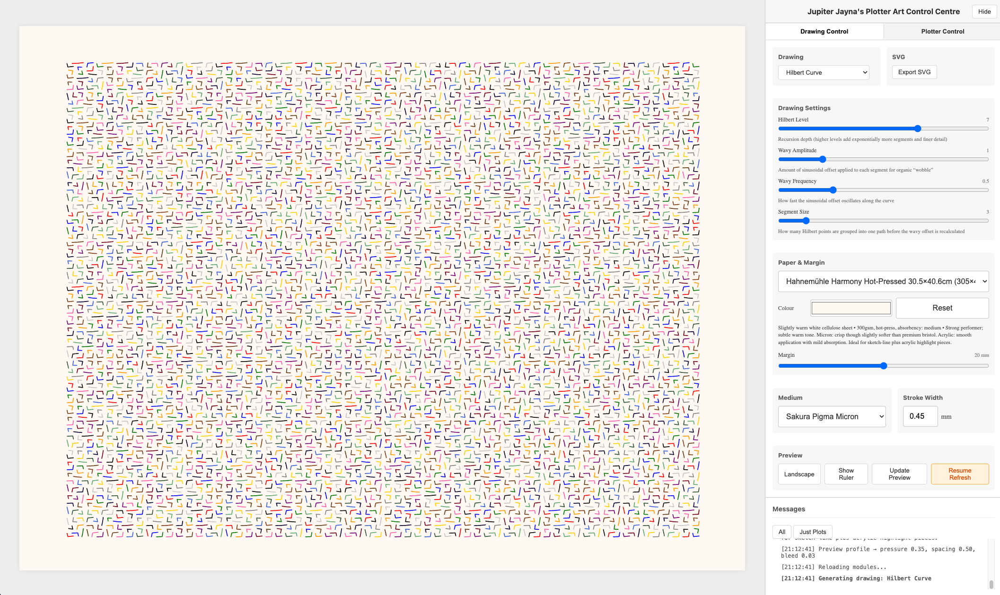
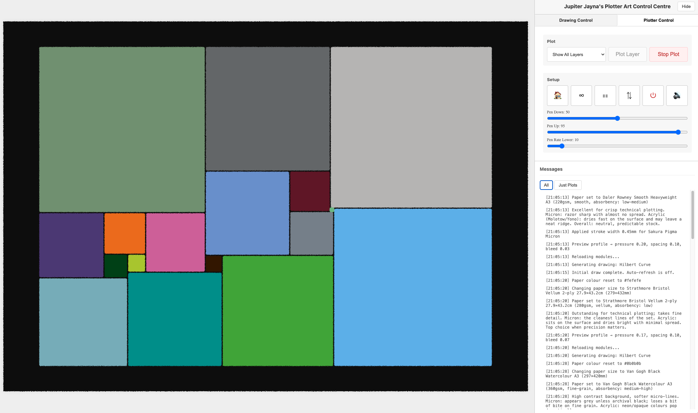

# Jupiter Jayna's Plotter Art Control Centre
*A plotter-first generative art workstation that goes from browser math to multi-pen AxiDraw output without leaving the keyboard.*

If you have an AxiDraw (or any plotter that can digest SVG layers) and love algorithmic art, this repo gives you a complete local studio: mm-accurate previews, color-aware layering, a Python server that proxies the axicli, and a set of battle-tested drawing algorithms (Bouwkamp perfect squares, Hilbert curves, phyllotaxis spirals, spirograph families, Voronoi sketches, Lorenz/Ikeda/de Jong attractors, and more). Everything ships as source, so you can bend it to your own plotting rituals or hack on it live during a stream.




> Optimized for the AxiDraw SE/A3 (penlift 3, SE servo), but nothing prevents you from wiring in another model by editing `server/plotter_config.py`.

## Why This Tool Exists

- **Bridges UI + hardware** - front-end sliders talk to a Python server that shells out to `axicli`, streaming progress back over SSE, so you can iterate fast without babysitting the machine.
- **Obsessive paper + pen modeling** - paper margins, nib widths, and medium presets are first-class citizens, so the SVG matches the sheet on your desk.
- **Algorithm playground** - the drawing registry is tiny, modern JavaScript; adding a new tiling or curve takes one module and hot reload, and any config knobs you expose are surfaced automatically in the “Drawing Settings” panel as sliders, selects, or number inputs. Built‑in modules cover Hilbert curves, Bouwkamp tilings, phyllotaxis spirals, spirograph families, Voronoi/Lloyd sketches, calibration grids, Lissajous curves, Superformula shapes, Clifford attractors, Lorenz/Ikeda/Peter de Jong attractors, flow fields, contour maps, wave interference, circle packing, DLA clusters, Truchet tiles, sorting arcs, and Gray‑Scott (Turing) patterns.
- **Transparency-first** - no cloud, no hidden binaries; everything from the Makefile to the SSE heartbeat loop is readable and hackable.

### Feature Highlights
- **Photo Triangles** – Polygon Margin slider (0–3 mm, 0.1 mm steps) keeps adjacent mosaic triangles from overlapping, mirroring the Simple Perfect Rectangle gutters.

- **Tabbed control console** – switch between Drawing settings and Plotter controls without scrolling. Each panel keeps its state, so you can tweak a control, hop over to the plotter, and return without losing context.
- **Paper-aware preview** – the merged “Paper & Margin” panel now blends the selected paper + medium metadata to set background color, simulate bleed/jitter via SVG filters, apply paper-specific texture overlays, surface warnings when a combo risks embossing or over-saturation, and (when rulers are on) outline the plotter’s maximum travel area.
- **Photo Triangles** – Polygon Margin slider (0–3 mm, 0.1 mm steps) keeps adjacent mosaic triangles from overlapping, mirroring the Simple Perfect Rectangle gutters.
- **Adaptive plotter defaults** – the Plotter Control tab auto-tunes `Pen Rate Lower` for each paper + medium combination so acrylic markers keep moving fast while delicate stocks slow the carriage to stay safe.
- **Layer travel caps** – the Plotter Control Medium panel now exposes a “Max Travel Per Layer” slider (1 m–100 m with an ∞ stop) that splits long paths/layers into multiple reload-friendly passes so ink never runs dry mid-color.
- **Calibration drawing** – ship a dedicated “Calibration Patterns” preset that lays out parallel lines, rings, multi-wave bundles, arc sweeps, Bezier ribbons, radial fans, touching polygons, and serpentine-filled shapes across adjustable spacing bands (including an SE/A3 micro-spacing stress row) so you can map slider values to real AxiDraw mechanics before committing a hero plot.
- **Per-drawing UI controls** – every drawing can declare sliders/selects (stroke spacing, Hilbert recursion level, etc.) via metadata, and the UI renders them automatically with persisted values.
- **Shared hatching library** – fill routines (serpentine, scanline, or none) can now be selected per drawing, and the helpers accept arbitrary polygons so future drawings inherit the same ink-friendly toolpaths.
- **Real-time plotting telemetry** – Axidraw’s `--progress` stream is piped straight into the Messages panel with a live, color-coded progress bar so you can see mm/s throughput and ETA without watching the terminal.
- **Resume-safe plotting** – each layer plot writes `output/plot_resume.log` and the Plotter panel exposes a Resume button whenever that log points to an interrupted job, so a Stop/Ctrl‑C doesn’t force you to rebuild the SVG. Starting a new layer automatically overwrites the log so “resume” always maps to the most recent plot.
- **Photo Triangles** – upload any reference image and the new mosaic drawing samples it, runs a point-weighted Delaunay triangulation, then hatches each triangle (serpentine/scanline/none via the global controls) with the nearest palette color so multi-pen plots can echo real photos.
- **Log-scale sliders** – controls like Hilbert’s segment size use logarithmic scaling under the hood to give fine-grained precision near zero while still allowing very large values.
- **Optimised Hilbert generator** – the curve now uses an iterative, bitwise implementation that handles high recursion levels gracefully.
- **Comprehensive tests** – Vitest covers the drawing registry, math helpers, and the new controls plumbing, so refactors stay safe.

## What Ships in This Repo

- **Client** - vanilla JS + CSS app (`client/js`, `client/templates`) with live preview, layer toggles, debug console, and mm ruler overlay.
- **Server** - Python `http.server` wrapper (`server/server.py`) that serves the UI, streams `/plot-progress`, and runs `bin/axicli` commands for each layer.
- **Config data** - `config/papers.json` and `config/mediums.json` describing margins, stroke widths, nib metadata, color palettes, and optional default preview colors.
- **Output pipeline** - timestamped SVGs in `output/` with configuration comments plus Inkscape-compatible layers ready for plotting or archival.
- **Docs + tooling** - Makefile, Vitest setup, TODO/CHANGELOG/CONTRIBUTING, and a reference screenshot so people know what they’re installing.
- **Drawings** - a top-level `drawings/` directory split into `core/` (maintained algorithms), `community/` (user-contributed experiments), and `shared/` helpers so contributions don’t need to dig through the client bundle.
    - Core set currently includes Bouwkamp perfect squares, Hilbert curves, phyllotaxis spirals, spirograph families, Voronoi sketches, Lissajous curves, Superformula shapes, Clifford attractors, Lorenz/Ikeda/Peter de Jong attractors, flow fields, contour maps, wave interference, circle packing, DLA clusters, Truchet tiles, sorting arcs, Gray‑Scott/Turing patterns, and the Calibration Patterns grid for paper/medium tuning.

```
├── client/
│   ├── js/…                 # Drawing registry, color utils, configs
│   ├── static/css/styles.css
│   └── templates/plotter.html
├── drawings/
│   ├── core/                # First-party drawing definitions
│   ├── community/           # User contributed drawings
│   ├── shared/              # Config bases + helpers + adapters
│   └── manifest.json        # Prebuilt manifest consumed by the loader
├── server/
│   ├── server.py            # HTTP + axicli bridge + SSE
│   ├── plotter_config.py    # Pen heights, penlift, model ids
│   └── server_runner.py     # Dev server with autoreload
├── config/
│   ├── papers.json          # ISO + Bristol presets w/ margins
│   └── mediums.json         # Pen brands, nib widths, stroke styles
└── Makefile / tests / docs  # Tooling, Vitest config, server docs
```

## Quick Start (macOS, local-first)

### Prerequisites

- macOS (project currently tested on Apple Silicon)
- Python 3.x
- Node.js 18+
- Git, Make, and a modern browser
- An AxiDraw SE/A3 (recommended) or any plotter that consumes layered SVGs

### Bootstrap the dev environment

```bash
make install   # virtualenv + pip deps + npm install
make run       # serves http://localhost:8000 with live reload
```

Then open <http://localhost:8000>, pick a drawing preset, tweak the sliders, and hit “Save SVG” or “Plot layer”.

### Tests & linting

```bash
make test      # runs the Vitest suite (client + helpers)
```

### Useful Make targets

| Command      | What it does                                                        |
|--------------|---------------------------------------------------------------------|
| `make install` | Sets up the Python venv and installs npm deps                       |
| `make run`     | Launches the Python dev server with live reload                     |
| `make dev`     | Installs deps, runs the manifest watcher, and starts the dev server |
| `make test`    | Executes Vitest (JS unit tests)                                     |
| `make clean`   | Removes temp files, venv, and `node_modules`                        |
| `make manifest`| Rebuilds `drawings/manifest.json` after adding drawings             |

## Plotting Pipeline

1. **Pick a drawing** - Bouwkamp codes, phyllotaxis spirals, spirograph families, Voronoi sketches, or Hilbert curves ship as presets; each exposes paper, margin, and color controls.
2. **Preview in mm** - the UI shows paper outlines, rulers, and margin sliders so the SVG framing matches your tape on the physical board.
3. **Generate layered SVG** - the client writes an Inkscape-ready SVG where each color sits in its own layer with stroke widths pulled from the selected medium preset (e.g., Sakura 0.45 mm round tip, Molotow ONE4ALL 2 mm).
4. **Stream to hardware** - pressing “Plot layer” posts the SVG + layer id to `/plotter`; the Python server writes a temp file, shells out to `bin/axicli`, and forwards stdout/stderr lines as SSE events.
5. **Monitor progress** - the log panel shows real-time output, estimated times, and completion/error markers; SSE keeps the UI hot even if the process is long-running.
6. **Archive outputs** - every successful save lands in `output/<drawing>/<timestamp>.svg` with configuration comments so you can reproduce the run later.

## Drawing Algorithms & Customization

Drop new experiments in `drawings/core/` (first-party) or `drawings/community/` (user-contributed) and they auto-register with the UI on the next reload. Each module exports a definition built with `defineDrawing`, so there’s very little wiring:

```javascript
import { defineDrawing, SizedDrawingConfig, createDrawingRuntime, colorPalettes } from '../shared/kit.js';

class MoireConfig extends SizedDrawingConfig {
  constructor(params = {}) {
    super({ width: 420, height: 297, ...params });
    this.seed = params.seed ?? 42;
  }
}

function drawMoireGrid(drawingConfig, renderContext) {
  const { svg, builder } = createDrawingRuntime({ drawingConfig, renderContext });
  // build geometry, append paths, etc.
  return svg;
}

export const moireDrawing = defineDrawing({
  id: 'moireGrid',
  name: 'Moire Grid',
  configClass: MoireConfig,
  drawFunction: drawMoireGrid,
  controls: [
    {
      id: 'curveDensity',
      label: 'Curve Density',
      target: 'drawingData.seed',
      inputType: 'range',
      min: 2,
      max: 12,
      step: 1,
      default: 6
    }
  ],
  presets: [
    {
      key: 'moireDefault',
      name: 'Moire Default',
      params: {
        type: 'moireGrid',
        seed: 42,
        line: { strokeWidth: 0.45 },
        colorPalette: colorPalettes.sakuraPalette
      }
    }
  ]
});
```

After dropping a new file in `drawings/core/` or `drawings/community/`, run `make manifest` (or `npm run build:drawings`) so the manifest/loader refreshes without restarting the server. When you use `make dev`, this rebuild happens automatically in the background.

- **Hot reload** - `server/server_runner.py` watches files so your new drawing appears after a save.
- **Constraint-aware helpers** - shared adapters expose color, geometry, and SVG utilities so modules don’t need deep client imports.
- **Paper + medium presets** - drop in a new pen brand or sheet size via JSON and it immediately appears in the UI selectors. Papers can specify finish, weight, absorbency, and preview colour (see [Paper Presets](#paper-presets)) and you can override the colour live with the picker next to the Paper dropdown.

### Photo Triangles

- Added a "Polygon Margin" slider (0–3 mm, 0.1 mm steps) so triangles inset before hatching and leave clean gutters like Simple Perfect Rectangle.

- Added a "Polygon Margin" slider (0–3 mm, 0.1 mm steps) so triangles inset before hatching and leave clean gutters like Simple Perfect Rectangle.

### Photo Triangles

- Added a "Polygon Margin" slider (0–3 mm) so artists can inset triangles and leave consistent gutters.
### Adding a Drawing with Codex (AI Pair Programming)

If you’re in the Codex CLI (this exact assistant), spinning up a new module is literally a prompt away:

1. `make dev` in one terminal so the watcher/manifest/server are running.
2. In another terminal, start Codex (`codex run` or the provided CLI).
3. Paste a prompt like:

```
Add a new drawing called "polygonTapestry" under drawings/core/. Use createDrawingRuntime to tile 6×4 randomly jittered rectangles, then hatch each polygon serpentine-style via the shared controls (spacing slider 0.2–4 mm). Include controls for polygon count, jitter, and hatch spacing, register a preset that uses the Sakura palette, rebuild the manifest, mention the new drawing in CHANGELOG/README, and run npm test.
```

Codex already knows the repository layout and AGENTS.md rules, so it will scaffold the module, hook up controls, rebuild `drawings/manifest.json`, update docs/tests, and even run `npm test` automatically. You can iterate conversationally (“tighten the jitter range”, “add Vitest coverage”, “document the control copy”) and watch the CLI apply patches in real time. When you’re happy, run `git status` to review, then commit with the suggested Conventional Commit message.

That’s it—new drawings are effectively an interactive prompt away.

### Custom Drawing Controls

Expose any parameter you care about by declaring a `controls` array in your drawing definition. Each entry provides an `id`, `label`, `target` path (for example, `drawingData.level`), and UI metadata (`inputType`, `min`, `max`, `step`, `options`, etc.). The client automatically renders those sliders/selects under **Drawing Settings**, remembers the tweaks per drawing, and reapplies them whenever you change paper, margin, medium, or orientation.

```javascript
import { attachControls } from '../shared/controlsUtils.js';

const controls = [
  {
    id: 'wavyAmplitude',
    label: 'Wavy Amplitude',
    target: 'drawingData.wavyAmplitude',
    inputType: 'range',
    min: 0,
    max: 5,
    step: 0.1,
    default: 1,
    description: 'Offsets Hilbert segments for an organic feel'
  },
  {
    id: 'segmentSize',
    label: 'Segment Size',
    target: 'drawingData.segmentSize',
    inputType: 'number',
    min: 2,
    max: 10,
    step: 1,
    default: 3
  }
]

export const hilbertDrawing = attachControls(defineDrawing({
  id: 'hilbert',
  name: 'Hilbert Curve',
  configClass: HilbertConfig,
  drawFunction: drawHilbertCurve,
  presets: [ /* ... */ ]
}), controls);
```

**Control metadata cheatsheet**

| Field             | Purpose                                                                                                 |
|-------------------|---------------------------------------------------------------------------------------------------------|
| `id`              | Unique key per drawing (used for persistence).                                                          |
| `target`          | Dot-path to mutate inside the `DrawingConfig` (e.g., `line.spacing`).                                   |
| `inputType`       | `"range"`, `"number"`, or `"select"`.                                                                   |
| `min` / `max`     | Absolute bounds applied to the actual value.                                                            |
| `inputMin` / `inputMax` | Optional slider bounds when using a non-linear mapping (e.g., log-scale).                          |
| `step` / `inputStep` | Slider increment for the actual value or just the UI control (again useful for log sliders).          |
| `scale`           | Set to `"log10"` to map the slider to a logarithmic space (great for values that span several orders). |
| `description`     | Appears under the control to guide users.                                                               |

Overrides live alongside the drawing config, so a slider change sticks even if you swap stock, toggle rulers, or revisit the drawing later in the session.

### Preview Paper Colour

Need to simulate black stock or toned paper before the plotter moves? Each paper preset may include an optional `"color": "#fefefe"` property in `config/papers.json`, and the UI now exposes a colour picker plus reset button next to the paper selector. The current colour only affects the preview/export metadata, so feel free to match whatever sheet is taped down without touching the drawing config itself.

## Paper Presets

Paper definitions live in `config/papers.json`. Each entry can include metadata that feeds both the UI (preview colour, bleed filters, hover logs) and the plotting defaults (pressure hints, recommended spacing).

```json
"strathmoreBristolVellum": {
  "width": 279,
  "height": 432,
  "margin": 23,
  "name": "Strathmore Bristol Vellum 2-ply",
  "description": "100% cotton vellum surface",
  "weightGsm": 280,
  "finish": "vellum",
  "absorbency": "low",
  "lineSharpness": "very-high",
  "dryingSpeed": "fast",
  "featherRisk": "very-low",
  "surfaceStrength": "excellent",
  "color": "#fefefe",
  "notes": "Outstanding for technical plotting."
}
```

The current presets ship with the following traits:

| Paper | Size (mm) | Weight | Finish | Traits & Notes |
|-------|-----------|--------|--------|----------------|
| Daler Rowney Smooth Heavyweight | 297 × 420 | 220 gsm | Smooth cartridge | Low bleed, fast drying, ideal for crisp technical lines |
| Daler Rowney Aquafine HP | 297 × 420 | 300 gsm | Hot-pressed watercolour | Slightly softer edges under heavy ink, excellent strength |
| Van Gogh Black Watercolour | 297 × 420 | 360 gsm | Fine grain | Deep black surface; medium bleed; slower drying |
| Hahnemühle Harmony Hot-Pressed | 305 × 406 | 300 gsm | Hot-pressed | Warm white tone, balanced absorbency, great strength |
| Strathmore Bristol Vellum 2-ply | 279 × 432 | ~280 gsm | Vellum (100% cotton) | Very sharp lines, minimal feathering, perfect for technical plotting |
| Hahnemühle Skizze 190 | 297 × 420 | 190 gsm | Smooth sketch | Lightweight sheet for tests and drafts |
| Cass Art Bristol A3 | 297 × 420 | 190 gsm | Smooth bristol | Crisp white surface, low bleed, ideal for lighter-weight plotting |

When you select a sheet, the UI renders the `description` + quick performance notes right under the dropdown, so you always know what is taped to the bed (even after a long debug session). These descriptions roll up the traits from JSON plus any medium-specific notes (e.g., how Sakura Microns vs. acrylic markers behave on a given stock).

The preview realism comes from `client/js/utils/paperProfile.js`, which merges:

1. Baseline medium behaviour (stroke pressure, hatch spacing, jitter, bleed) from `config/mediums.json`.
2. Paper metadata (finish, absorbency, surface strength) from `config/papers.json`.
3. Optional overrides for specific medium + paper pairs (e.g., “Sakura on Strathmore Bristol”).

The resulting profile drives the live SVG filter (`client/js/utils/previewEffects.js`) that adds a subtle Gaussian blur + displacement map. The filters are injected only for the preview and stripped automatically before you export or plot, so the vector output remains crisp.

Add your own stock by copying one of the entries, tweaking the dimensions, and filling out whatever metadata makes sense for your workflow. The UI will automatically log the new traits when you select it, and the preview colour will match whatever `color` you set.

## Color & Multi-Pen Layering

- Smart palette selection prevents adjacent fills from sharing a color, reducing smears on real paper.
- Layers map directly to pen labels (e.g., `Black-0.5mm`, `Copper-2mm`), so you can queue them in AxiDraw’s layer mode.
- Medium presets store nib geometry, stroke widths, and suggested pressure settings, matching actual pen behavior.
- Margin slider locks framing numerically + visually, so orientation swaps keep the artwork centered on both portrait and landscape sheets.

## Server & Plotter Controls

- `server/server.py` extends `SimpleHTTPRequestHandler`, serving the UI and exposing JSON commands at `/plotter`.
- Supported commands include `plot`, `stop_plot`, `raise_pen`, `toggle`, `align`, `cycle`, `home`, and `disable_motors` (see `docs/server_commands.md` for payloads).
- `/plot-progress` streams Server-Sent Events with heartbeats plus `PLOT_COMPLETE` / `PLOT_ERROR` markers so the UI can recover automatically.
- `config/plotters.json` defines model numbers, servo behavior, and specs for each supported device; the server loads it via `plotter_config.py`, so switching models is as simple as changing the `"default"` entry.
- **Resume flow** – every plot now passes `--output_file output/plot_resume.log`. If you stop a job (UI Stop button or Ctrl‑C) the log sticks around, `/resume-status` reports that a resume is available, and the Plotter panel enables a **Resume Plot** button. Clicking it shells `axicli output/plot_resume.log --mode res_plot --progress` (still wrapped with `caffeinate`/`systemd-inhibit`) so you can continue without re-rendering the drawing. Launching a new plot overwrites the log so the button always targets the most recent attempt.
- **Auto-home safeguard** – clicking **Plot Layer** automatically raises the pen and walks home before spawning `axicli --mode layers`, so a previously paused plot can’t restart from a mid-sheet position and stress the hardware. The manual **Home** button runs the same sequence and clears any resume file.
- **Max travel slider** – the Plotter Control tab’s Medium panel adds a “Max Travel Per Layer” slider (1–100 m plus an ∞ stop). Values come from the current paper/medium combo but can be overridden; the runtime splits any path/layer that would exceed the cap before plotting so you can reload paint or ink at predictable intervals.

## Development & Testing

- **Install dependencies** – `make install` (Python venv + npm).
- **Run the dev server** – `make dev` (rebuilds the drawings manifest, watches for changes, and launches the Python server with autoreload).
- **Tests** – `npm test` runs the Vitest suite. The shared tests cover the drawing registry, control helpers, render contexts, preview heuristics (`drawings/shared/__tests__/previewProfile.test.js`), and the SVG filter plumbing (`client/js/utils/__tests__/previewEffects.test.js`) without touching the network.
- **Drawing manifest** – `npm run build:drawings` (or `make manifest`) must be executed after adding or renaming drawing modules so the client can discover them.
- **Code style** – the repo sticks to modern ES modules, ESLint defaults, and Vitest assertions. Python files follow PEP 8 and reuse the logging helpers in `server/server.py`.
- **Contributing** – see [CONTRIBUTING.md](CONTRIBUTING.md) for workflow details, commit conventions, and review expectations.

## Roadmap & Known Issues

This is live code, and we keep the paper cuts documented:

- `/plot-progress` currently uses a single-threaded `HTTPServer`; long-lived SSE requests block other endpoints until we move to `ThreadingHTTPServer` or a worker thread.
- Plot streaming reads `axicli` stderr synchronously; if stderr blocks, stdout stalls and the subprocess can hang. Needs non-blocking IO.
- Static asset and SVG export endpoints trust path parameters, allowing `../` traversal. We need canonicalization + validation.
- Auto-refresh in `client/templates/plotter.html` can fire overlapping async `draw()` calls. Guard refreshes with an “in-flight” flag.
- Python server endpoints (`/plotter`, `/plot-progress`, `/save-svg`) lack automated tests; coverage is on the TODO list.

Additional backlog items live in `TODOs.md`.

## Community, Support & Contributions

- Check or open issues on GitHub: <https://github.com/sdjayna/super-duper-octo-robot/issues>
- Contribution guidelines cover workflow, docs, and code style: [CONTRIBUTING.md](CONTRIBUTING.md)
- For support, please include browser version, error logs, reproduction steps, and (if relevant) the SVG configuration snippet with your issue.

## License & Credits

- MIT License - see [LICENSE](LICENSE)
- Uses Evil Mad Scientist’s AxiDraw CLI (`bin/axicli`) under their terms.
- Huge thanks to C.J. Bouwkamp for the perfect square research, the Clipper library for polygon ops, and the broader algorithmic art community for years of shared techniques.
- Developed by Jupiter Jayna with heavy inspiration from acrylic plotter workflows; sample work: <https://plotter.art>

## Built with AI Pair Programming

Development leaned on AI copilots (aider.chat, DeepSeek R1, Claude 3 Sonnet) for fast iteration while keeping humans in the loop for aesthetics, safety, and hardware testing.
- **Paper presets** – edit `config/papers.json` to describe stock in terms of size, weight, finish, absorbency, bleed, and notes. The UI logs these traits when you switch sheets so you don’t lose track of what’s loaded on the bed.
- **A3 parameter cheatsheet** – the table below captures the ranges we’ve found to sit nicely on an A3 SE/A3 bed without murdering line density:

| Algorithm | A3-friendly settings |
|-----------|----------------------|
| Lissajous Curves | Frequencies 3–9, phase offsets 0.1–0.3 rad, amplitude ≈ 90 % of the shorter dimension, 2k–4k samples. |
| Superformula | `m` 3–12, `n1` `n2` `n3` between 0.3–8, radius around 130 mm with 1–3 mm layer offsets. Avoid exponents > 12 unless you want brutal spikes. |
| Clifford Attractor | Start at `a` 1.7–1.9, `b` 1.8–2.1, `c` 0.1–0.5, `d` 0.6–1.2. Plot 150k–400k iterations; add ~0.1 mm jitter for smoky strokes. |
| Hilbert Curve | Depth 6–7 fills A3 at sane density. Scale to ~260 × 260 mm; rotate 45° if you want a less rigid footprint. |
| Turing Patterns | Feed 0.02–0.06, kill 0.05–0.07, diffusion ratio roughly 1 : 0.5 for classic stripes, 500×500 grid, downsample to ~150–250 contours. |
| Phyllotaxis | Divergence 137.5°, radial step 3–6 mm, 600–1200 points, jitter up to 0.5 mm for liveliness. |
| Epicycloids / Hypotrochoids | `R` 80–140 mm, `r` 20–70 mm, `d` 10–50 mm, 4k–12k points, layer rotations 2–8°. |
| Voronoi / Lloyd sketches | Seed count 150–450 with 1–2 relaxations. Clip to ≈ 380 × 260 mm. Use thick pens sparingly unless you want bold geography. |
| Flow Fields | Noise scale 0.01–0.04, step length 1–2 mm, 2k–6k particles, 200–800 integration steps. |
| Lorenz Attractor | σ = 10, β ≈ 2.6–3.0, ρ ≈ 25–30, `dt` 0.005–0.015, 80k–400k iterations (< 0.2 mm stroke). |
| Ikeda Attractor | `u` 0.85–0.98, 80k–250k iterations, smoothing 0–0.05 to tame crossings. |
| Peter de Jong Attractor | Parameters `a`–`d` between −3–3, 120k–400k iterations, smoothing 0–0.1 for smoky layers. |
| Contour Maps (noise) | Noise freq 0.003–0.02, octaves 2–5, contour spacing 3–6 units, map ≈ 400 × 280 mm. |
| Wave Interference | 3–7 emitters, wavelengths 60–200 mm, random phases, draw contours at 0.0/0.2/0.4/0.6. |
| Circle Packing | Radii 3–18 mm (bimodal works nicely), rejection distance 1.05–1.2× radius sum, 200–600 circles for comfortable density. |
| Truchet Tiles | Grid 20×30 up to 40×60, two or three motifs, rotation skewed toward 0°/180° for long arcs. |
| Sorting-Algorithm Arcs | Array size 80–200, gentle shuffle for smoother arcs, bubble sort for density, quicksort for broad structure. |
